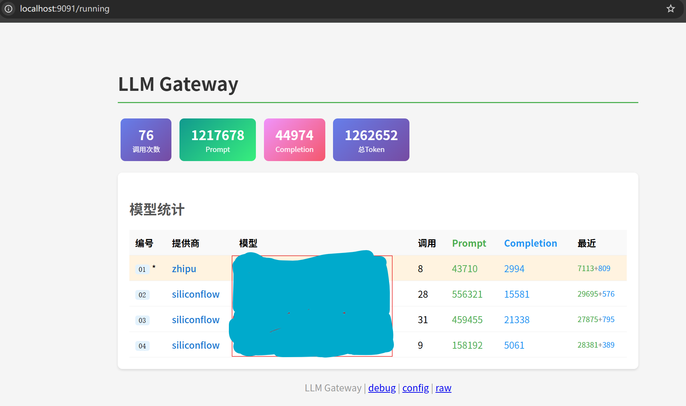

# LLM Gateway

A unified reverse proxy for multiple LLM providers with intelligent load balancing and automatic failover.

## Features

- **Multi-Provider Support** - OpenAI, Anthropic, SiliconFlow, ZhiPu and more
- **Intelligent Failover** - Automatic switching between primary and backup models with cooldown mechanism
- **Cost Optimization** - Route requests to cheaper models when quota is reached
- **Real-time Statistics** - Monitor usage at `/running` endpoint
- **Hot Reload** - Update Lua routing logic without restart
- **Redis Configuration** - Dynamic configuration at runtime

## Demo



## Architecture

```
Client Request → Pingora (HTTP Server)
                    ↓
              Lua Router (Business Logic)
                    ↓
               Redis (Config & Stats)
                    ↓
              reqwest (Upstream Connection)
                    ↓
              LLM Provider API
```

## Quick Start

```bash
# Build
cargo build --release

# Run with environment variables
REDIS_URL=redis://127.0.0.1:7379 LLM_LISTEN=0.0.0.0:9090 ./target/release/llm-gateway
```

## Endpoints

| Endpoint | Description |
|----------|-------------|
| `/running` | Real-time statistics dashboard |
| `/debug` | Current routing status |
| `/config` | View LLM configuration |
| `/v1/chat/completions` | Chat Completions API |
| `/v1/embeddings` | Embeddings API |
| `/rerank` | Rerank API |

## Failover Mechanism

1. Primary LLM serves requests until `switch_threshold` is reached
2. Gateway searches for available backup (02, 03, ...)
3. Selected backup enters `cooldown` period
4. After cooldown, traffic returns to primary

## Configuration

### Redis Keys

| Key | Format | Example |
|-----|--------|---------|
| `provider:{name}` | `baseurl\|apikey` | `https://api.siliconflow.cn/v1\|sk-xxx` |
| `llm:{num}` | `provider\|model\|cd` | `siliconflow\|Qwen/Qwen3.5-4B\|15` |
| `llm:select` | Current primary LLM number | `01` |
| `llm:config:switch_threshold` | Switch threshold | `10` |

### Environment Variables

| Variable | Default |
|----------|---------|
| `REDIS_URL` | `redis://127.0.0.1:7379` |
| `LLM_LISTEN` | `0.0.0.0:9090` |
| `LLM_SCRIPT` | `lua/router.lua` |

## Why This Project?

Managing multiple LLM providers is painful:
- Different APIs, keys, and model names
- Rate limits and quotas vary by provider
- Cost optimization requires manual switching
- No unified view of token consumption

**LLM Gateway solves this with:**
- Single endpoint for all providers
- Automatic failover when quota reached
- Real-time cost and usage monitoring
- Zero-downtime configuration updates

## 来自人类的补充

	AI 总结得不错，我来补充一点---单纯就是被claude-mem的超高token消耗气糊涂了。气急败坏之下解耦了claude-mem的调用，
	捞出来看看究竟消耗多少。本着来都来了的想法，干脆把切换的功能也在这个项目搞了吧。
	
	现在这个版本，应该就是最终版了，如果还有什么需求，交给AI都能搞定。（Lua方便测试和快速迭代，大概是AI友好的）

## License

MIT
